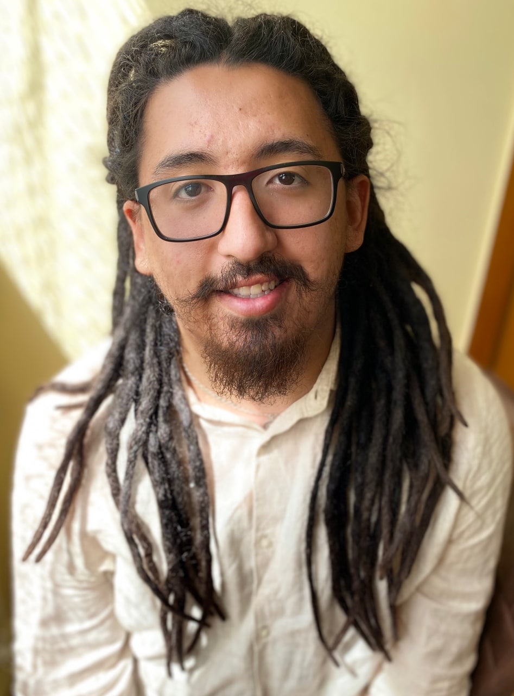

[На русском](https://saifutdinov.github.io) | [English version](https://saifutdinov.github.io/en/)

---
#### Navigation
[About me](#about-me) | [Senior engineer position](#senior-engineer-position) | [Team lead position](#team-lead-position)
| [Additional](#additional) | [Contacts](#contacts)

---

# About me
I am an experienced developer specializing in backend development and team management. My goal is to establish efficient development processes and help businesses achieve their objectives by delivering reliable, scalable solutions. 

- **birthday**: 26.12.1997
- **Current location**: La Union, Spain
- **ready to relocate**: no

## Languages and localization
- **Russian**: native
- **Bashkir**: native
- **English**: B2 (technical and businness discussions)  
- **Spanish**: active learning! 
- I've got a lot of experiance to live and work in multi-cutural environment (Currently living in Spain)
- Имею опыт жизни и работы в мультикультурной среде (нахожусь в Испании)

## Career Goals
- Ready to step into a Tech Lead / Team Lead role to have a greater impact on the development process and team growth  
- Want to help a new company expand by enhancing and refining technical solutions
- Open to remote work and able to start within one month of receiving an offer

---

# Senior engineer position
## Key skills
- **Languages**: Golang (4+ years), PHP (9+ years), JavsSript (9+ years), HTML+CSS (9+ years)
- **Frameworks**: Echo (go), Laravel, Symfony (php), Vue, React (js), Sass, Scss, Tailwind(css), Bootstrap
- **Database**: SQL (Postgres, MySQL, sqlite, Oracle), NoSQL (MongoDB), cache (redis, memcached)
- **VCS**: git, Github (pages), Gitlab (CE & runners), ci&cd, Bitbucket
- **Infrastructure**: linux, docker, docker-compose, k8s, n8n, webpack, gulp, vite
- **Instruments**: bash, nginx, apache, elasticsearch, RabbitMQ/Kafka, exim, PDF References(custom PDF generator), certbot+letsencrypt, postman, swagger
- **Tesing**: unit tests

---

## Work experiance

### University Project, Moscow. (PHP + JS + CSS). 2015 - 2019 г. (4 years)
- Implemented a REST API (PHP 5.6)
- Set up and maintained the database (MySQL, PDO)
- Deployed the product via SFTP and configured LAMP/LNMP server environments

---

### BSSL, Moscow.  2019 - Present (6 years)
#### - legacy-code PHP + MongoDB. 2019 - Present (6 years)
A singleton project with a long history of improvements and transformations, originally handed over by senior developers. I've been continuously maintaining and enhancing this legacy system, which uses PHP 5.6. This project also introduced me to a custom PDF generator written in PHP, leveraging PDF references for file creation.

- Migrated and optimized inherited systems
- Configured MongoDB to handle unique data storage challenges  
- Participated in planning phases and integrated new modules
- Developed numerous Excel exports of varying complexity and PDF reports for diverse clients

---

#### - Golang + React. 2022 - Present (4 years)
Together with the team, I designed and developed a large-scale project, azimuth.team. You can learn more about the project at the link above; here are the key points
- Tech Stack: Golang, React, Postgesql
- API Development: Built and optimized a REST API using the Golang Echo framework
- CI/CD and Deployment: Set up pipelines for both backend (Go) and frontend (React, native JS, Webpack, Gulp), along with a mail server (Exim) integration featuring spam protection  
- Architecture and Modules: Contributed to designing the architecture and building extensible modules
    - Successfully split the project layers according to Clean Architecture principles
- Certificates Management: Configured and automated certificate renewals (Certbot + Let’s Encrypt)
- Custom Go Packages: Wrote several packages for handling maps, slices, requests/responses, panics, errors, and caching (via the sync package), enabling more flexible use of the language
- Alerts System: Implemented an alert system using long polling (React) and channels (Go)

---

### Freelance (PHP + Laravel/Symfony + Vue/React + MongoDB/SQL) 2023 - Present (3 years)
During this period, I’ve tackled a variety of client requests and developed an “Updater” tool that uses .sh scripts to automatically upgrade project versions (particularly useful when code is hosted on a client’s server and updates are optional).
- Developed web applications for clients using Laravel
- Implemented front-end solutions with Vue.js (Vite)
- Planned and deployed projects within tight timelines
- Created data parsers for handling complex data transformations

---

# Team lead position
## Key skills
- **Methodologies and Tools**: Agile/Scrum (planning, sprints, retrospectives), GitHub Issues, Trello, Notion
- **Mentoring**: training new hires and enhancing team members’ skills
- **Leadership**: building teams, conducting code reviews, assigning tasks, resolving conflicts, testing products, and managing documentation
- **Interaction**: ensuring effective cross-team and cross-department communication
- **Analytics**: thoroughly identifying and addressing “pain points” within the team to keep projects and products on track
- **Team Evaluation**: assessing skills, competencies, and team interactions to identify strengths and weaknesses, then taking action to resolve any issues

---

## Experience
### University Project, Moscow. (PHP + JS + CSS). 2015 - 2019 г. (4 years)
During university, we were encouraged to work in teams on diverse tasks, including drafting technical requirements (TR), interacting directly with clients (professors, a business incubator), and collaborating with other teams (classmates) for efficient project development.
- Prepared project documentation
- Tested new project features and investigated bugs

---

### BSSL, Moscow.  2019 - Present (6 years)
Throughout my time at BSSL, I’ve had the opportunity to work with a range of colleagues, each with a different approach to product development and client interaction.
- Trained new hires on how to use the platform and effectively collaborate within the development team
- Worked directly with clients to gather requirements (technical specifications)
- Tested new features, performed code reviews, and conducted 1-to-1 sessions to resolve conflicts or misunderstandings
- Identified resource gaps and redirected development efforts to meet key objectives
- Implemented SEO optimizations for the landing page
- Processed large data sets within Excel for reporting and exports

---

### Freelance
Working directly with clients without a “manager buffer” allowed me to build the entire client engagement process myself, enabling rapid and flexible responses to client requirements. 
- Drafted technical specifications collaboratively with clients
- Collaborated with other developers, conducting code reviews and guiding development direction
- Helped clients gain a new perspective on their product for a deeper understanding of the project’s potential

---

# Additional

## Education
### Mospolytech (Moscow Polytechnic University) (2015 - 2019 г.)
- Faculty **"Information Systems and Technologies"**
- Specialization **"Web Development"**

During my time at university, I gained the skills to develop a project from the initial idea stage to the first MVP—along with attracting initial investors. I also completed a course on online project promotion, including SEO optimization for search engines.

Each year, we were divided into teams and given a project assignment to work on throughout the academic year, culminating in a final presentation to our instructors. I was responsible for backend, frontend, and mobile development, as well as preparing the project documentation.

---

## Summary

I started taking an interest in development back in 2014 while still in school, writing simple applications in PHP and JavaScript. At university, I gained enough knowledge to begin working by my second year, which I did. After graduating, I landed a junior developer role, where I received mentorship from senior engineers—an experience that helped me become a confident developer and contribute significantly to my company. I’m grateful for the supportive environment, great colleagues, and engaging projects, and in return I delivered high-quality development and loyalty.

However, we all grow eventually, and now I’m ready to move forward! After reflecting on my career path, I’ve decided that leading a team is a natural next step for me as a Senior Engineer. I understand how challenging it can be to find the right person to head up a team or a strategic area, and I’m confident that I can excel in this role.

---

## Others
Together with my colleagues at BSSL, we developed a universal platform to conduct a wide range of surveys. One of these is the [“Big Potential Test”](https://azimuth.team/go/btp)!.

Here are my own results: [link to results](https://azimuth.team/result/3243813746456470411/6286647688042621408/0/0/7c231c655082be7cf9591da61f120752234edf9c52e4f2834cdad310b3dd3b42/0/ru#undefined)
I was pleasantly surprised by the outcome—many of the insights lined up with what my friends and family have observed about me.

---

## Projects

### rarutils 
 - Golang package for working with rar and unrar utilities, currently under development.
[Github](https://github.com/Saifutdinov/rarutils) 

---

## Contacts
- **Email**: <sayfutdinov.aydar.web@gmail.com>
- **GitHub**: [github.com/Saifutdinov](https://github.com/Saifutdinov)  
- **LinkedIn**: [linkedin.com/in/sayfutdinov-aydar](https://www.linkedin.com/in/sayfutdinov-aydar/)
- **Website**: [Saifutdinov.github.io](https://saifutdinov.github.io)
- **Telegram**: [@Saifutdinov_a](https://t.me/Saifutdinov_a)

<!-- Google tag (gtag.js) -->

